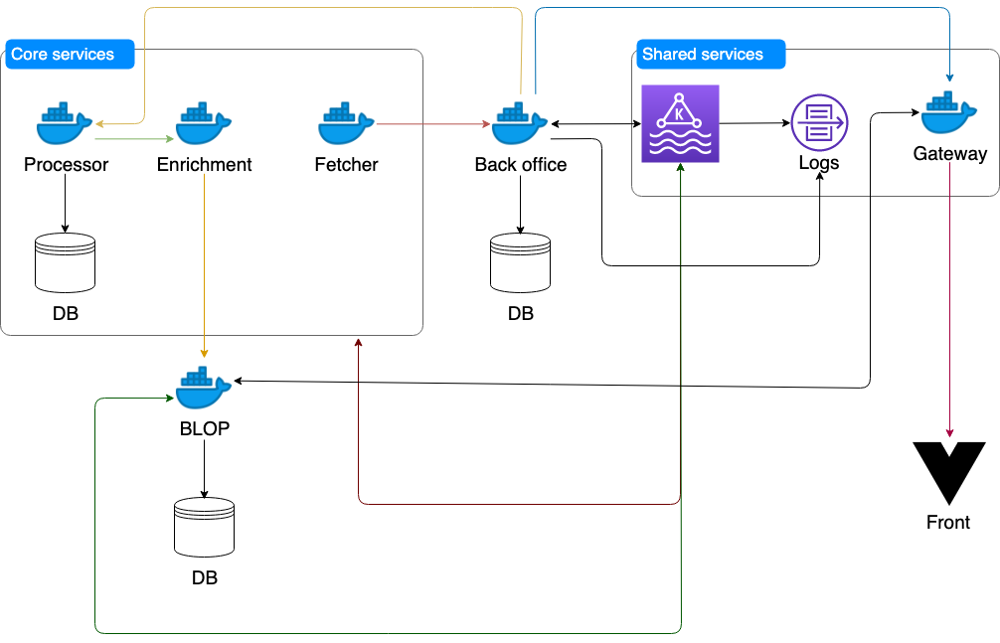

# Open Pension

[![license][license-image]][license-url] [![Build Status][travis-image]][travis-url] [![Dependency Status][dependency-image]][dependency-url] [![codecov][codecov-image]][codecov-url] [![Contributors][contributors-image]][contributors-url] [![Gitter][gitter-image]][gitter-url]

> The repo contains the server & the client parts of the Open Pension project.
Open Pension is [a "Hasadna" project](http://www.hasadna.org.il/), that aimed to 
revealing the secrets behind the Israeli pension market.

### Project structure


We use docker, with docker compose, to manage all the services we use. There are
three main services that help us to get the data properly:
* Fetcher - The fetcher service download for us all the source files from the 
pension companies.
* Processor - After we got the files we need convert them into JSON object which
can be use for processing.
* Enrichment - The JSON objects we got from the fetcher used don't have fully
qualified value. Each company can have various way to be represented - Teva,
T.E.V.A, teva, tv25 etc. etc. etc. The service takes those variations and 
converts them to a unify texts.

The other services are peripheral services:

* BLOP - The data go into the `BLOP` service which is a `postgress` and `Flask` 
that holds the data in a SQL tables.
* Gateway - The gateway service provides a single graphql endpoint which allow 
us to communicate with the other services.
* Client - A `react` app that serves all the data.
* Backoffice - Gives us dashboard for managing other services:
    * Content such as blogs, enrichment tables, user authentication and more
    * Manage downloaded files, manually upload files for processing 
    * Watch logs from other services
    * Fix uploaded files
* Kafka - give us the option to notify services of events that occurred in other 
services.
* Logs - Allow us to log events which occurred in service: a file has been 
processed, file downloaded.


### Pre requirements:

  1. Install Docker (make sure you have docker compose).

### Installation:

  1. Run `docker-compose up -d`.
  2. Make sure you have [NodeJS](nodejs.org)
  3. Install [Angular CLI](https://github.com/angular/angular-cli)
  4. move to client directory: `cd client`
  5. run: `npm i`
  6. run: `npm run build -- --watch`

## Tests

**Client**

  * Run `npm run lint` to check for lint mistakes.
  * Run `npm run test` to execute the unit tests via [Karma](https://karma-runner.github.io).
  * Run `npm run e2e` to execute the end-to-end tests via [Protractor](http://www.protractortest.org/).

**Server**

### In order to execute any python commands you have to do it inside the service container `docker-compose exec [service-name] /bin/sh` this will open the shell inside the container

  * Run `pycodestyle --show-source --max-line-length=120 --exclude=pension/migrations --show-pep8 .` to check for lint mistakes.
  * Run `isort . --recursive --check-only` to check for import mistakes.
  * Run `python manage.py test` to run the unit tetst.
  
  
## Kafka
```bash
./bin/kafka-console-consumer.sh --bootstrap-server localhost:9092 --whitelist '.*'
./bin/kafka-topics.sh --bootstrap-server localhost:9092 --list
```

[license-image]: https://img.shields.io/badge/license-MIT-blue.svg
[license-url]: https://github.com/hasadna/open_pension/blob/master/LICENSE
[travis-image]: https://travis-ci.org/hasadna/open_pension.svg?branch=master
[travis-url]: https://travis-ci.org/hasadna/open_pension
[dependency-image]: https://dependencyci.com/github/hasadna/open_pension/badge
[dependency-url]: https://dependencyci.com/github/hasadna/open_pension
[codecov-image]: https://codecov.io/gh/hasadna/open_pension/branch/master/graph/badge.svg
[codecov-url]: https://codecov.io/gh/hasadna/open_pension
[gitter-image]: https://img.shields.io/badge/Gitter-Join_the_chat_%E2%86%92-00d06f.svg
[gitter-url]: https://gitter.im/open-pension/Lobby?utm_source=badge&utm_medium=badge&utm_campaign=pr-badge&utm_content=badge
[contributors-image]: https://img.shields.io/github/contributors/hasadna/open_pension.svg
[contributors-url]: https://github.com/hasadna/open_pension/graphs/contributors
