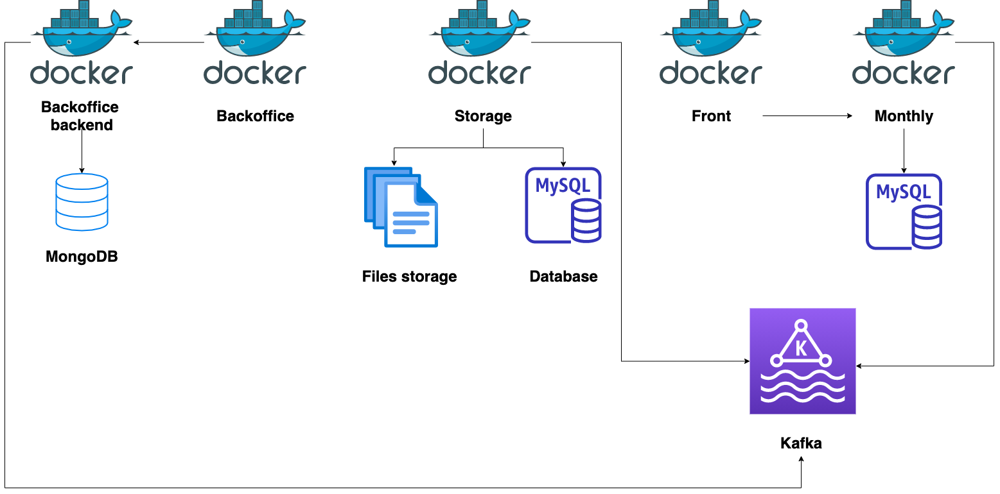

# Open Pension


Open pension is a project which aims to provide an easy way for people to explore where the money from the pension funds invested is invested. The project belong to the ["Hasadna" project](http://www.hasadna.org.il/) - an NPO which thrives for clreance and opening the data.

Revealing where the money is invested and by whom helps to find out which hidden motives play roles in managing the money.

## Project structure


The project uses a microservice's architecture:

### Front
This is the site which allow the users to watch where the money is invested, graphs to present data, links to the articles and more. The service uses `NextJS` which help us to use static pages when needed and SSR when need to display live content (like graphs and more).

### Monthly
The monthly process XML files and process them to data which we can process later on. The data is processed on a MySQL server. We're using `NodeJS`, `GraphQL` and `Prisma.io` for that.

### Storage
Since we don't know where we're going to host the service (AWS, google cloud, azure...), the service receives files, or listen to kafka events for download files from other services, and store them on a physical drive.
Each file get a storage ID which helps us to track where the file was stored or what data which processed is relates to. The service is written in `go` and use `MySQL` for store the data.

### Backoffice
The service help us to orchestrate the other services: upload new files for processing, create users, manage content and more. The service is using `react` for the content, `mongo` for storing users and other data and allow us to see how a file was processed.

### Backoffice backend
This is the backend for the backoffice. Written in `NodeJS`, `GraphQL`, `MongoDB`.

## Pre requirements:
You'll need to install:
* Docker
* [nvm](https://github.com/nvm-sh/nvm) -  Most of the servies works with node version of `14.17.3`
* [Go lang](https://golang.org/)

## Start working with the services:
The docker machine are already ready for development. You can have two options:

### Turn on all the services
This will fire up all the services. This one is a good options if you need to run them all:

```bash  
docker-compose up -d```  
  
### Turn on a specific service:  
There are a couple of services that we are handling: `monthly`, `storage`, `monthly`, `backoffice`, `backoffice_bakend`  
  
For that all you need to do:  
```bash  
docker-compose up -d monthly # But you can go with the other service which mentioned above.
```  

### Developing the front
For now, the front has a couple of technical issues to be developed under a docker instance. So you need to go to the front folder and install. It's basically goes like this:
```bash  
cd front
npm inpm run dev
```  

## Data seed

After everything is all set up, you need to have two thing: a user to admin and some dummy data in the monthly DB.

### Creating user
login to the backoffice backend:

```bash  
docker-compose up exec backoffice_backend bashnpm run cli:createUser
```  

You would then go through questions for the credentials of the user. Remember, this must be a very strong password.

### Seeding the monthly DB
Unlike the admin user, the seeding data is good for playing around with the monthly service. It's not a must but good   
when we need to develop the project:

```bash  
docker-compose up exec monthly bashnpm run dummySeed
```  

## Accessing the services:

* `backoffice` - `http://backoffice.localhost/`
* `backoffice_backend` - `http://backoffice-api.localhost/`
* `monthly` - `http://monthly.localhost/`
* `storage` - `http://storage.localhost`

## Cheatsheets:
Here are some couple of command lines snippets which can help you work with the services:

### Kafka
```bash  
./bin/kafka-console-consumer.sh --bootstrap-server localhost:9092 --whitelist '.*'./bin/kafka-topics.sh --bootstrap-server localhost:9092 --list
```  

### Debugging
If you need to debug, you can run your local backend with the next mongo address:  
`mongodb://localhost:27017/open_pesion_dashboard`
 
